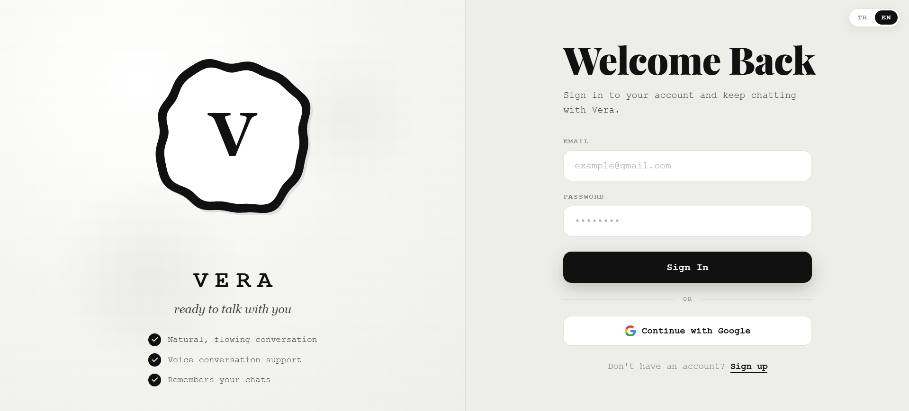
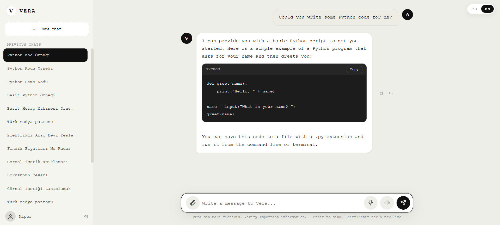
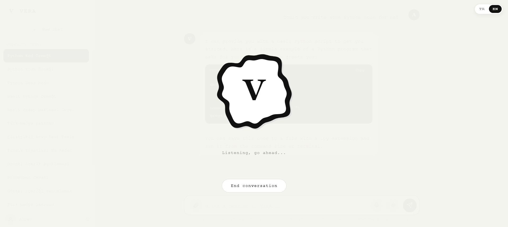
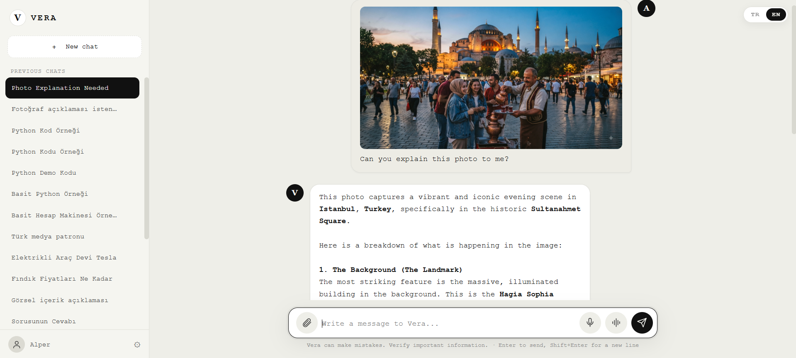
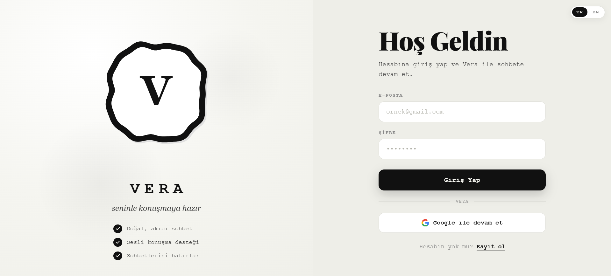
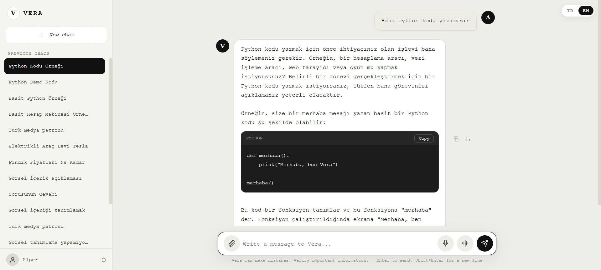
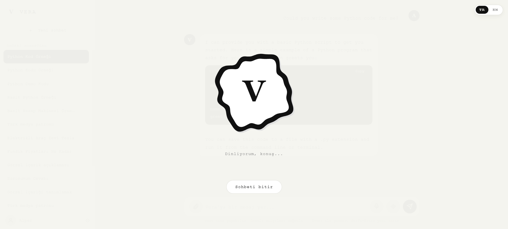
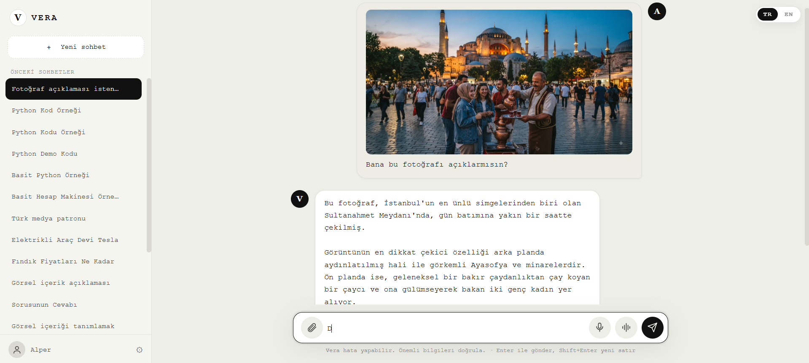

<h1 align="center">🤖 VeraAI Web</h1>
<p align="center">A web-based AI assistant — built with Python/Flask, a Groq LLM layer &amp; a MySQL backend — that chats naturally in text and <strong>live voice</strong>, understands the photos you upload, transcribes your speech and answers back out loud. It fetches <strong>live weather</strong> for any city on Earth via OpenWeather tool-calling (the AI decides when to look it up), remembers your conversation history and speaks both Turkish &amp; English with one-click language switching.</p>
<p align="center">Python/Flask, Groq yapay zeka katmanı ve MySQL arka ucuyla geliştirilmiş web tabanlı bir yapay zeka asistanı — metinle ve <strong>canlı sesle</strong> doğal biçimde sohbet eder, yüklediğin fotoğrafları anlar, konuşmanı yazıya döker ve sesli cevap verir. OpenWeather tool-calling ile dünyanın herhangi bir şehri için <strong>canlı hava durumu</strong> çeker (ne zaman bakacağına yapay zeka karar verir), sohbet geçmişini hatırlar ve tek tuşla Türkçe &amp; İngilizce konuşur.</p>

<p align="center">
  
  
  
  
  
  
  
  
</p>

<p align="center">
  <a href="#-english">🌐 English</a> •
  <a href="#-türkçe">🇹🇷 Türkçe</a>
</p>

---

<h3 align="center">🎬 Demo Video</h3>

<p align="center">
  <video src="https://github.com/AlperT-Code/VeraAI-Web/raw/main/video/video.mp4" controls muted width="820"></video>
</p>

<p align="center">
  <a href="https://github.com/AlperT-Code/VeraAI-Web/raw/main/video/video.mp4"></a>
  &nbsp;
  <a href="https://github.com/AlperT-Code/VeraAI-Web/raw/main/video/video.mp4?download="></a>
</p>
<p align="center"><sub><em>If the player doesn't load above, use the buttons to watch or download the demo.</em></sub></p>

<br>

<h1 align="center" id="-english">🌐 English</h1>
<hr>

## 📖 About

**VeraAI Web** (her name is **Vera**) is a web-based AI assistant that feels like talking to a friend. You sign up, and Vera chats with you in **natural text or live voice**, keeping every conversation saved so you can pick up where you left off. Upload a **photo** and she describes and reasons about it; **speak** and she transcribes you with Whisper and answers **out loud** with a natural neural voice. She also decides — on her own — when a question needs **real-time data**, and pulls **live weather for any city or country** from OpenWeather. The whole experience is wrapped in an elegant, cream-and-black design with an organic animated "blob" background, and it speaks both **Turkish and English** with one-click switching.

> **Your data stays yours.** Passwords are hashed, conversations live in your own MySQL database, and API keys never reach the browser — they stay server-side in `.env`.

## ✨ Features

**Natural chat, powered by Groq**
- Streaming text chat with **Llama 3.3 70B**, so replies appear word-by-word in real time
- Full **conversation history** in MySQL — rename, revisit and delete past chats
- Vera always replies in **the language you write in** (Turkish or English), warm and to the point

**Live voice conversation**
- **Speak and be heard** — record your voice, Vera transcribes it with **Groq Whisper**
- **Vera talks back** — replies are spoken aloud with **edge-tts** neural voices (Emel for TR, Jenny for EN)
- Full hands-free voice loop in Chrome / Edge

**Vision — she sees your photos**
- Upload an image and a **Groq vision model** describes and analyses what's in it
- Video uploads are stored (content analysis coming later)

**Live weather — the AI decides**
- Ask "How's the weather in Tokyo?" — in **text or voice** — and Vera **decides on her own** to call the `get_weather` tool
- Real-time **OpenWeather** data (temperature, feels-like, humidity, wind, conditions) for **any city or country** on Earth
- She never makes it up; she fetches the live reading and phrases it naturally **in your language**

**Bilingual & polished UI**
- Full **TR / EN** interface with **one-click language switching** (`i18n.js`)
- Cream–black minimal theme with an organic animated **blob** background
- Profile with avatar upload, fully responsive

## 🛠️ Tech Stack

- **Python 3 + Flask** — web server, routes and REST API
- **Groq** — Llama 3.3 70B (text), a vision model (image understanding), Whisper (speech-to-text)
- **OpenWeather API** — live weather via LLM tool-calling
- **MySQL** — users and conversation history (auto-initialised on first run)
- **edge-tts** — neural text-to-speech for spoken replies
- **Vanilla HTML/CSS/JS** — custom design, zero front-end build step

## 📸 Screenshots

<p align="center">
  
</p>
<p align="center">
  
</p>
<p align="center">
  
</p>
<p align="center">
  
</p>

## ⚙️ How it works

- **`app.py`** — the Flask server: auth, chat/stream endpoints, transcription, TTS and uploads
- **`vera_ai.py`** — the Groq layer: text chat (with weather **tool-calling**), vision, Whisper and TTS
- **`weather.py`** — the OpenWeather tool the AI calls when a question needs live weather
- **`database.py`** — MySQL: auto-setup, users and message history
- **`config.py`** — reads all settings and API keys from `.env`
- **`templates/`** — login, register and chat pages
- **`static/`** — the shared theme, blob animation, chat, voice and i18n logic

## 📁 Project Structure

```
VeraAI-Web/
├── app.py                  # Flask server & routes
├── vera_ai.py               # Groq layer (chat + vision + whisper + TTS + tools)
├── weather.py                # OpenWeather live-weather tool
├── config.py                  # Reads settings & keys from .env
├── database.py                 # MySQL: auto-setup + queries
├── requirements.txt             # Python dependencies
├── .env.example                  # Template for keys & config
├── templates/
│   ├── login.html
│   ├── register.html
│   └── chat.html                  # The chat app
├── static/
│   ├── css/style.css               # Cream–black premium theme
│   ├── js/
│   │   ├── chat.js                  # Chat engine (streaming)
│   │   ├── voice.js                  # Live voice loop
│   │   ├── i18n.js                    # TR / EN switching
│   │   └── blob.js                     # Animated background
│   └── favicon.svg
├── img/                                  # Screenshots used in this README
├── video/                                 # Demo video
├── LICENSE
├── .gitignore
└── README.md
```

## 🚀 Usage

1. Clone the repository
   ```bash
   git clone https://github.com/AlperT-Code/VeraAI-Web.git
   cd VeraAI-Web
   ```
2. Install dependencies (Python 3.10+ recommended)
   ```bash
   pip install -r requirements.txt
   ```
3. Make sure **MySQL 8.0** is running. The database and tables are created **automatically** on first run.
4. Copy the env template and add your keys:
   ```bash
   copy .env.example .env
   ```
   - `GROQ_API_KEY` — required for chat, vision and voice ([console.groq.com](https://console.groq.com))
   - `OPENWEATHER_API_KEY` — enables live weather ([openweathermap.org/api](https://openweathermap.org/api))
   - `DB_*` — your MySQL host / user / password
5. Run it
   ```bash
   python app.py
   ```
   Then open **http://localhost:5000** (it opens your browser automatically).

## 🤝 Contributing

1. Fork the repository
2. Create a new branch
3. Commit your changes
4. Push the branch
5. Open a pull request

## ⚖️ Notes & Disclaimer

- **Groq cannot generate images or video** — it only does text, image *understanding* and speech-to-text.
- Live voice chat uses the browser's Web Speech / MediaRecorder APIs → **Chrome or Edge** recommended.
- Keep your API keys private. `.env` is git-ignored; never commit real keys.

## 📝 License

This project is licensed under the [MIT License](LICENSE) — © 2026 AlperT-Code.

<br><br><br><br>

<h1 align="center" id="-türkçe">🇹🇷 Türkçe</h1>
<hr>

## 📖 Hakkında

**VeraAI Web** (adı **Vera**), bir arkadaşınla konuşuyormuş hissi veren web tabanlı bir yapay zeka asistanıdır. Kaydolursun ve Vera seninle **doğal metinle ya da canlı sesle** sohbet eder; her konuşmayı kaydettiği için kaldığın yerden devam edebilirsin. Bir **fotoğraf** yükle, onu tarif edip yorumlasın; **konuş**, seni Whisper ile yazıya döksün ve doğal bir neural sesle **sesli** cevap versin. Ayrıca bir soruya **gerçek zamanlı veri** gerektiğinde bunu **kendisi** fark eder ve OpenWeather'dan **dünyanın herhangi bir şehri/ülkesi için canlı hava durumu** çeker. Tüm deneyim; organik animasyonlu "blob" arka planı olan zarif krem–siyah bir tasarımla sarılıdır ve tek tuşla **Türkçe ile İngilizce** arasında geçiş yapar.

> **Verin sana ait.** Şifreler hash'lenir, sohbetler kendi MySQL veritabanında durur ve API anahtarları tarayıcıya asla ulaşmaz — sunucuda, `.env` içinde kalır.

## ✨ Özellikler

**Groq ile doğal sohbet**
- **Llama 3.3 70B** ile akışlı metin sohbeti — cevaplar kelime kelime, gerçek zamanlı belirir
- MySQL'de tam **sohbet geçmişi** — eski konuşmaları yeniden adlandır, aç ve sil
- Vera her zaman **senin yazdığın dilde** cevap verir (Türkçe veya İngilizce), sıcak ve öz

**Canlı sesli konuşma**
- **Konuş, seni duysun** — sesini kaydet, Vera **Groq Whisper** ile yazıya döksün
- **Vera sesli cevap versin** — cevaplar **edge-tts** neural sesleriyle okunur (TR için Emel, EN için Jenny)
- Chrome / Edge'de tam eller serbest sesli döngü

**Görüş — fotoğraflarını görür**
- Bir görsel yükle; **Groq vision modeli** içindekini tarif edip analiz etsin
- Video yüklemeleri saklanır (içerik analizi ileride)

**Canlı hava durumu — kararı yapay zeka verir**
- "Tokyo'da hava nasıl?" diye sor — **yazarak ya da sesli** — Vera `get_weather` aracını **kendisi** çağırmaya karar versin
- Dünyanın **herhangi bir şehri/ülkesi** için gerçek zamanlı **OpenWeather** verisi (sıcaklık, hissedilen, nem, rüzgâr, durum)
- Asla uydurmaz; canlı ölçümü çeker ve **senin dilinde** doğal bir cümleyle aktarır

**İki dilli & şık arayüz**
- **Tek tuşla dil değişimiyle** tam **TR / EN** arayüz (`i18n.js`)
- Organik animasyonlu **blob** arka planı olan krem–siyah minimal tema
- Avatar yükleme destekli profil, tamamen responsive

## 🛠️ Kullanılan Teknolojiler

- **Python 3 + Flask** — web sunucusu, rotalar ve REST API
- **Groq** — Llama 3.3 70B (metin), vision modeli (görsel anlama), Whisper (ses→metin)
- **OpenWeather API** — LLM tool-calling ile canlı hava durumu
- **MySQL** — kullanıcılar ve sohbet geçmişi (ilk çalıştırmada otomatik kurulur)
- **edge-tts** — sesli cevaplar için neural metin-okuma
- **Vanilla HTML/CSS/JS** — özel tasarım, sıfır front-end build adımı

## 📸 Ekran Görüntüleri

<p align="center">
  
</p>
<p align="center">
  
</p>
<p align="center">
  
</p>
<p align="center">
  
</p>

## ⚙️ Nasıl Çalışıyor

- **`app.py`** — Flask sunucusu: kimlik doğrulama, sohbet/akış uçları, transkripsiyon, TTS ve yükleme
- **`vera_ai.py`** — Groq katmanı: metin sohbeti (hava durumu **tool-calling** ile), vision, Whisper ve TTS
- **`weather.py`** — bir soruya canlı hava durumu gerektiğinde yapay zekanın çağırdığı OpenWeather aracı
- **`database.py`** — MySQL: otomatik kurulum, kullanıcılar ve mesaj geçmişi
- **`config.py`** — tüm ayarları ve API anahtarlarını `.env`'den okur
- **`templates/`** — giriş, kayıt ve sohbet sayfaları
- **`static/`** — ortak tema, blob animasyonu, sohbet, ses ve i18n mantığı

## 📁 Proje Yapısı

```
VeraAI-Web/
├── app.py                  # Flask sunucusu & rotalar
├── vera_ai.py               # Groq katmanı (sohbet + görüş + whisper + TTS + araçlar)
├── weather.py                # OpenWeather canlı hava durumu aracı
├── config.py                  # Ayarları & anahtarları .env'den okur
├── database.py                 # MySQL: otomatik kurulum + sorgular
├── requirements.txt             # Python bağımlılıkları
├── .env.example                  # Anahtar & ayar şablonu
├── templates/
│   ├── login.html
│   ├── register.html
│   └── chat.html                  # Sohbet uygulaması
├── static/
│   ├── css/style.css               # Krem–siyah premium tema
│   ├── js/
│   │   ├── chat.js                  # Sohbet motoru (akış)
│   │   ├── voice.js                  # Canlı ses döngüsü
│   │   ├── i18n.js                    # TR / EN geçişi
│   │   └── blob.js                     # Animasyonlu arka plan
│   └── favicon.svg
├── img/                                  # Bu README'deki ekran görüntüleri
├── video/                                 # Tanıtım videosu
├── LICENSE
├── .gitignore
└── README.md
```

## 🚀 Kullanım

1. Depoyu klonla
   ```bash
   git clone https://github.com/AlperT-Code/VeraAI-Web.git
   cd VeraAI-Web
   ```
2. Bağımlılıkları kur (Python 3.10+ önerilir)
   ```bash
   pip install -r requirements.txt
   ```
3. **MySQL 8.0**'ın çalıştığından emin ol. Veritabanı ve tablolar ilk çalıştırmada **otomatik** oluşturulur.
4. Env şablonunu kopyala ve anahtarlarını ekle:
   ```bash
   copy .env.example .env
   ```
   - `GROQ_API_KEY` — sohbet, görüş ve ses için gerekli ([console.groq.com](https://console.groq.com))
   - `OPENWEATHER_API_KEY` — canlı hava durumunu etkinleştirir ([openweathermap.org/api](https://openweathermap.org/api))
   - `DB_*` — MySQL host / kullanıcı / şifre bilgilerin
5. Çalıştır
   ```bash
   python app.py
   ```
   Ardından **http://localhost:5000** adresini aç (tarayıcıyı otomatik açar).

## 🤝 Katkıda Bulunma

1. Projeyi fork'la
2. Yeni bir branch oluştur
3. Değişikliklerini commit et
4. Branch'i push et
5. Pull request oluştur

## ⚖️ Notlar & Sorumluluk Reddi

- **Groq görsel veya video ÜRETEMEZ** — yalnızca metin, görsel *anlama* ve ses→metin yapar.
- Canlı sesli sohbet tarayıcının Web Speech / MediaRecorder API'lerini kullanır → **Chrome veya Edge** önerilir.
- API anahtarlarını gizli tut. `.env` git tarafından yok sayılır; gerçek anahtarları asla commit'leme.

## 📝 Lisans

Bu proje [MIT Lisansı](LICENSE) ile lisanslanmıştır — © 2026 AlperT-Code.
